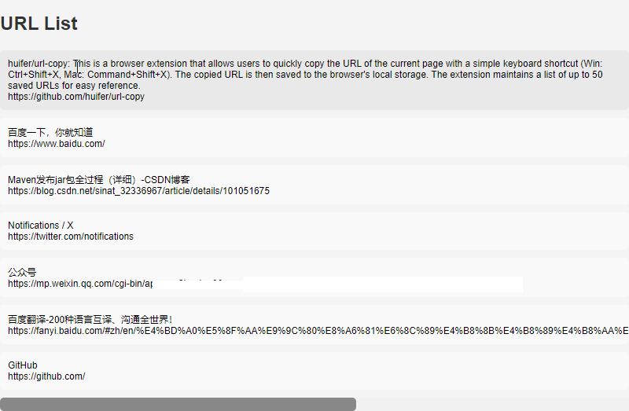

# URL Copy

  <a href="./README.md">English</a> |
  <a href="./readme_CN.md">中文</a>

This is a browser extension that allows users to quickly copy the URL of the current page with a simple keyboard shortcut (Win: Ctrl+Shift+X, Mac: Command+Shift+X). The copied URL is then saved to the browser's local storage. The extension maintains a list of up to 50 saved URLs for easy reference.

## Features

- **Easy URL Copying**: Press the designated keyboard shortcut to instantly copy the URL of the current webpage.
- **Local Storage**: Saved URLs are stored locally, allowing users to access them even after closing and reopening the browser.
- **Maximum Capacity**: The extension keeps track of up to 50 URLs, ensuring that users have access to their most recent URLs for quick reference.

## Installation

### Chrome

1. Clone or download this repository.
2. Open Chrome and navigate to `chrome://extensions/`.
3. Enable "Developer mode" in the top right corner.
4. Click on "Load unpacked" and select the directory where you cloned/downloaded the repository.

## Usage

1. Once the extension is installed, navigate to any webpage.
2. Press the keyboard shortcut:
    - Windows: Ctrl+Shift+X
    - Mac: Command+Shift+X
3. The URL of the current page will be copied to the clipboard and saved to the extension's local storage.
4. To access the saved URLs, click on the extension icon and select "View Saved URLs".

## Development

If you want to contribute to the development of this extension, follow these steps:

1. Fork and clone this repository.
2. Make your changes.
3. Test your changes thoroughly.
4. Submit a pull request explaining the changes you've made. Click to copy complete information.

## License

This project is licensed under the [MIT License](LICENSE). Feel free to use and modify this extension according to your needs.

## Acknowledgments

- This extension was inspired by the need for a quick and efficient way to copy and save URLs while browsing the web.
- Special thanks to the developers of Chrome for providing powerful extension APIs.

If you encounter any issues or have suggestions for improvement, feel free to open an issue on GitHub. Thank you for using Browser Extension URL Copy!