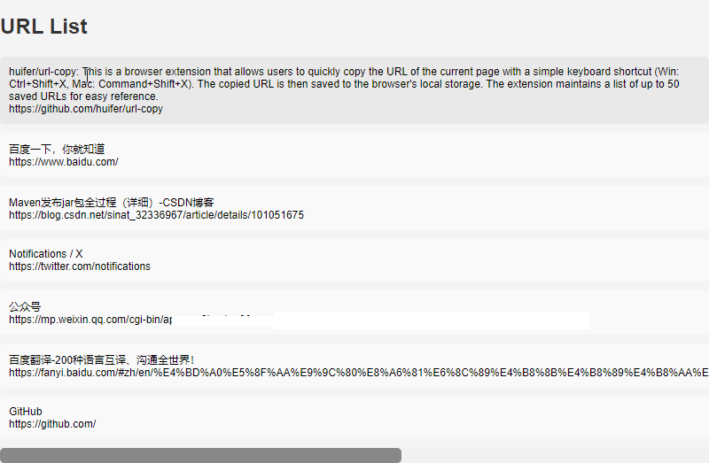

# URL COPY

  <a href="./README.md">English</a> |
  <a href="./readme_CN.md">中文</a>

这是一个浏览器插件，允许用户通过简单的键盘快捷键（Win: Ctrl+Shift+X，Mac: Command+Shift+X）快速复制当前页面的 URL。复制的 URL 将保存到浏览器的本地存储中。该插件最多保留 50 个已保存的 URL，方便用户查询使用。

## 功能

- **轻松复制 URL**：按下指定的键盘快捷键即可快速复制当前网页的 URL。
- **本地存储**：已保存的 URL 会存储在本地，即使关闭并重新打开浏览器，用户仍然可以访问它们。
- **最大容量**：该插件最多保留 50 个 URL，确保用户能够快速访问最近的 URL。

## 安装

### Chrome

1. 克隆或下载此存储库。
2. 打开 Chrome 并导航到 `chrome://extensions/`。
3. 在右上角启用“开发者模式”。
4. 点击“加载已解压的扩展程序”，选择您克隆/下载存储库的目录。

## 使用方法

1. 安装完插件后，打开任何网页。
2. 按下键盘快捷键：
    - Windows：Ctrl+Shift+X
    - Mac：Command+Shift+X
3. 当前页面的 URL 将被复制到剪贴板并保存到插件的本地存储中。
4. 要访问保存的 URL，请单击扩展图标，然后选择“查看已保存的 URL”。点击后可以复制完整信息

## 开发

如果您想为此插件的开发做出贡献，请按照以下步骤操作：

1. Fork 并克隆此存储库。
2. 进行您的更改。
3. 充分测试您的更改。
4. 提交一个解释您所做更改的拉取请求。

## 许可证

本项目采用 [MIT 许可证](LICENSE)。请根据您的需求自由使用和修改此插件。

## 致谢

- 此插件的灵感来自于在浏览网页时快速有效地复制和保存 URL 的需求。
- 特别感谢 Chrome 的开发人员提供了强大的扩展 API。

如果您遇到任何问题或有改进建议，请在 GitHub 上提出问题。感谢您使用浏览器插件 URL 复制！